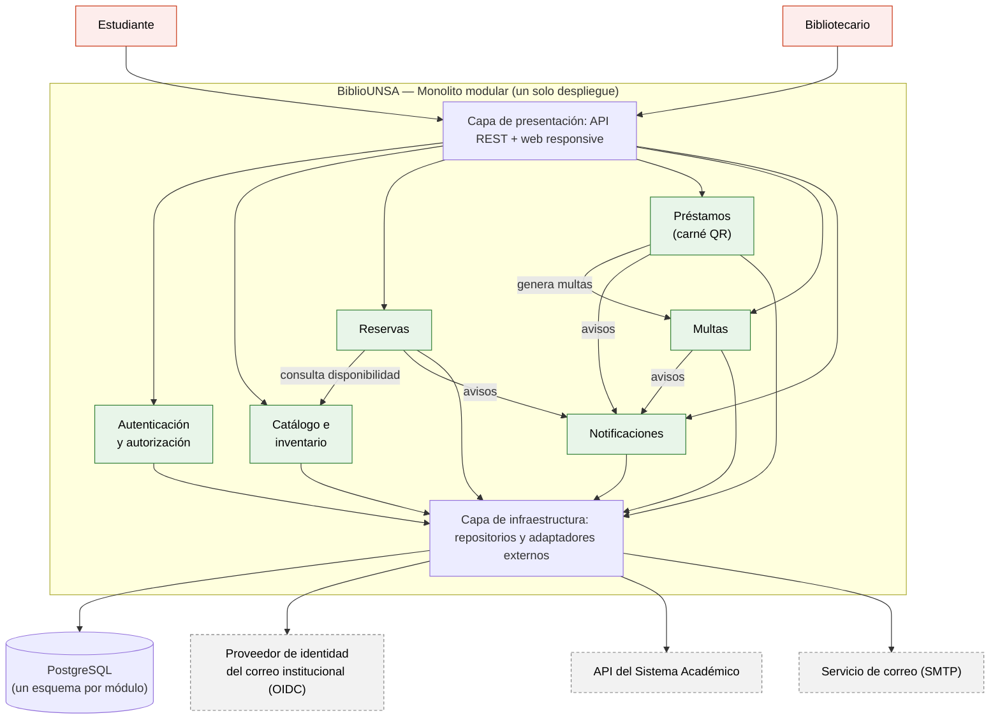

# BiblioUNSA — Laboratorio 04: Fundamentos de arquitectura de software
Construcción de Software · EPIS-UNSA · 2026-B · Grupo XX

## Integrantes
| Nombre | Rol en el laboratorio |
|--------|-----------------------|
| Marco David Chávez Chambi | Redactor de ADR y verificador de IA |
| Frayd Yande Llavilla Machaca | Diagramador (Mermaid, PlantUML y Python Diagrams) y redactor de drivers y matriz de decisión |

## Caso
BiblioUNSA es una plataforma para el préstamo y reserva de libros de las bibliotecas de la UNSA. Los actores son el estudiante, el bibliotecario y el sistema académico. El MVP ofrece catálogo en línea, reserva de libros, préstamo con carné QR, control de multas y validación de matrícula vigente. El acceso es con el correo institucional y el sistema académico se consulta solo por API, sin acceso directo a su base de datos. El **atributo de calidad crítico es la seguridad** (junto con la interoperabilidad); el MVP debe salir en 1 mes con 2 developers y un VPS.

## Arquitectura elegida
Monolito modular con 6 módulos, un esquema de PostgreSQL por módulo e integraciones externas aisladas en adaptadores (ver [matriz de decisión](docs/architecture/matriz-decision.md): 4,15 frente a 3,60 de capas y 2,85 de microservicios).

## Entregables
- [Drivers y escenarios de calidad (E1)](docs/architecture/drivers.md)
- [Matriz de decisión (E2)](docs/architecture/matriz-decision.md)
- Diagramas (E3, E5, E6): [`arquitectura.mmd`](docs/architecture/diagramas/arquitectura.mmd), [`alternativa.puml`](docs/architecture/diagramas/alternativa.puml), [`despliegue.py`](docs/architecture/diagramas/despliegue.py) e imágenes en [`img/`](docs/architecture/diagramas/img/)
- [Bitácora de uso de IA (E7)](docs/architecture/bitacora-ia.md)
- [Cuestionario resuelto](docs/cuestionario.md)

## Decisiones arquitectónicas
- [ADR-001: Estilo arquitectónico (monolito modular)](docs/architecture/adr/001-estilo-arquitectonico.md)
- [ADR-002: Autenticación con el correo institucional](docs/architecture/adr/002-autenticacion-correo-institucional.md)
- [ADR-003: Integración con el sistema académico](docs/architecture/adr/003-integracion-sistema-academico.md)

## Reflexión sobre el uso de la IA
La IA nos ayudó a generar y comparar alternativas rápidamente, a redactar borradores de ADR y a escribir el código de los diagramas, y su crítica de "abogado del diablo" nos hizo agregar mitigaciones concretas como el adaptador con reintentos y las pruebas de límites entre módulos. También cometió errores: asumió que el correo institucional ofrece inicio de sesión estándar (OIDC) sin que el caso lo diga, y fue necesario corregir la nota de la alternativa descartada para que citara los puntajes reales. Aprendimos a verificar cada afirmación contra los drivers (R-01 a R-06), a recalcular los totales con un script y a marcar como supuesto todo dato que la IA no pueda respaldar. Las decisiones finales las tomó el equipo y todo uso de la IA quedó registrado en la bitácora.
